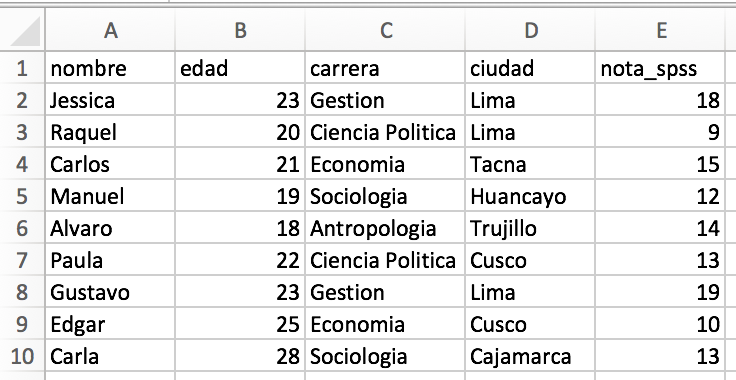
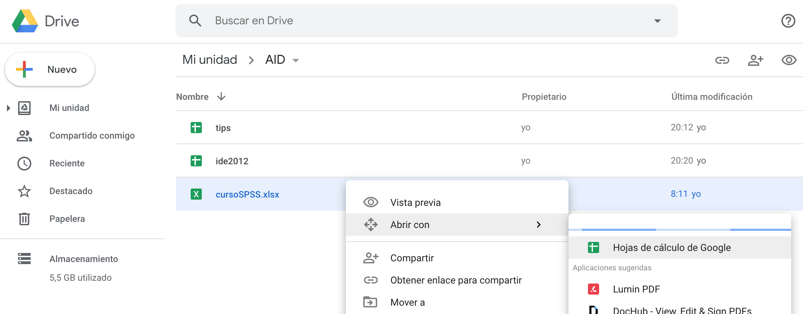
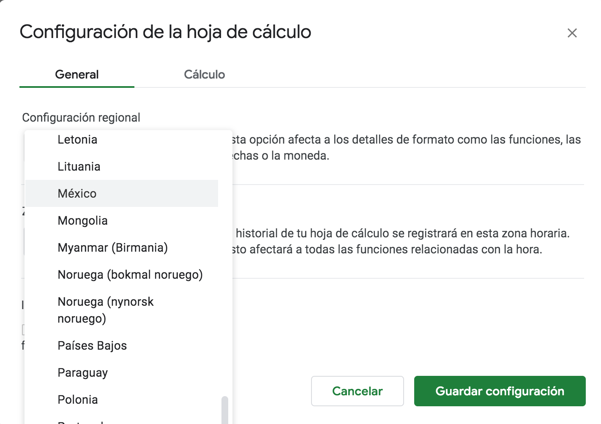
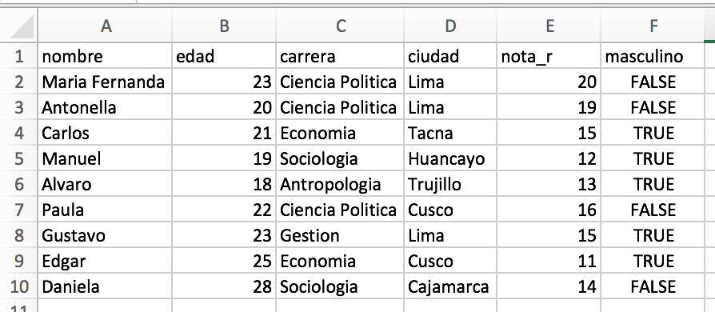

# CURSO DE ACTUALIZACION EN ESTADISTICA

#### Profesor: Dr. José Manuel MAGALLANES, Ph.D

____

## Sesión 1: 

## **Definiciones básicas e Introducción al _R_**

## Ejercicios:

Descargue un archivo en Excel de este [link](https://github.com/CoursesAndTutorials/Estadistica/raw/master/data/cursoSPSS.xlsx). 

Este archivo contiene información de alumnos que llevaron un curso de SPSS: 



Traiga esa data a R siguiendo los siguientes pasos:

a. Suba este archivo a GoogleDrive
b. Una vez que el archivo esté en GoogleDrive, ábralo como GoogleSheet.


c. Guardelo como documento de Google.
d. Verifique la región por defecto de GoogleSheet, elija MEXICO como default.

e. Publique el archivo como CSV y copie el **link** que se genera.


Una vez tenga el link, ábralo con el comando presentado anteriormente, utilizando la misma configuración. El objeto de R que recibe los datos se llamará *alumnosSpss*. A partir de ahi, responda:

* ¿Cuál fue la nota en SPSS de Manuel?
```{r,echo=FALSE,eval=FALSE}
alumnosSpss[alumnosSpss$nombre=='Manuel',"nota_spss"]
```

* ¿Cuál es el nombre del alumno con mayor edad?

```{r,echo=FALSE,eval=FALSE}
alumnosSpss[alumnosSpss$edad==max(alumnosSpss$edad),"nombre"]
```


* ¿De qué carrera es la maxima nota en Spss?
```{r,echo=FALSE,eval=FALSE}
alumnosSpss[alumnosSpss$nota_spss==max(alumnosSpss$nota_spss),"carrera"]
```


* ¿Cuál es la carrera del alumno con menor nota en SPSS de Lima?

```{r,echo=FALSE,eval=FALSE}
alumnosSpss[alumnosSpss$ciudad=='Lima' & alumnosSpss$nota_spss==min(alumnosSpss$nota_spss),"carrera"]
```


_______

Descargue otro archivo en Excel de este [link](https://github.com/CoursesAndTutorials/Estadistica/raw/master/data/cursoR.xlsx).



La data contiene información de alumnos que llevaron un curso de R. Siga los pasos anteriores y luego creer el objeto *alumnosR* para guardar los datos. Muchos de los alumnos que llevaron el curso de SPSS también llevaron el curso de R.

El comando merge nos permite juntar ambos **data frames**, añadiendo toda la información (variables) que tenemos disponible sobre los mismos casos. La información completa de nuestros casos puede ser guardada en un nuevo objeto así:

```{r,echo=TRUE,eval=FALSE}
alumnos_total = merge(alumnosSpss,alumnosR)
alumnos_total
```


Genere el código para responder las siguientes preguntas usando "alumnos_total":

* ¿Cuál es la nota en SPSS del alumno con mejor nota en R?
```{r,echo=FALSE,eval=FALSE}
alumnos_total[alumnos_total$nota_r==max(alumnos_total$nota_r),'nota_spss']
```


* ¿Qué alumno obtuvo más de 15 en R y más de 15 en SPSS?
```{r,echo=FALSE,eval=FALSE}
alumnos_total[(alumnos_total$nota_spss>15) & alumnos_total$nota_r>15,]
```


* ¿De qué carrera es el alumno que obtuvo 15 en R y 15 en SPSS?
```{r,echo=FALSE,eval=FALSE}
alumnos_total[(alumnos_total$nota_spss==15) & alumnos_total$nota_r==15,'carrera']
```

Al final, guarde estos resultados usando **RPubs**. Simplemente siga los pasos de publicación sugeridos por R.

____


[Volver al programa del curso](https://coursesandtutorials.github.io/Estadistica/)

