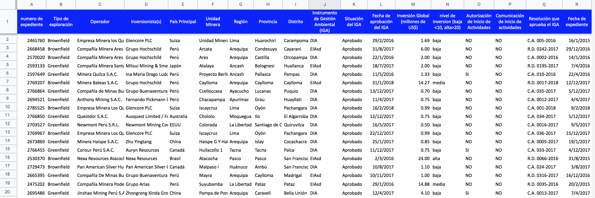
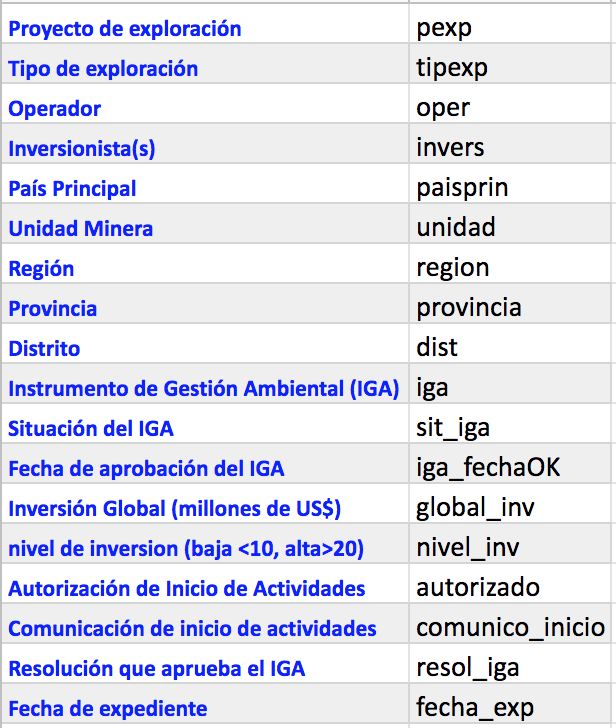

# CURSO DE ACTUALIZACION EN ESTADISTICA

#### Profesor: Dr. José Manuel MAGALLANES, Ph.D

____

## Sesión 2: 

## **Exploración de Datos Categóricos en R**

## Ejercicios:

Este archivo contiene información de proyectos de exploración minera para el 2018: 



1. Sabiendo que el link a esa data es:

https://docs.google.com/spreadsheets/d/e/2PACX-1vSaZQ88MJaKumH0inYTW5mWZhQmcfUhbxT8is0MbX26Ypj8JBnYv58muKhqzDt37UF2tpJxLywNe7Ct/pub?gid=130298120&single=true&output=csv

Traiga tal archivo a RStudio usando el comando **read.csv**, dele nombre _data2018_ al objeto que recibe la data:

```{r, echo=TRUE, eval=TRUE}
link="https://docs.google.com/spreadsheets/d/e/2PACX-1vSaZQ88MJaKumH0inYTW5mWZhQmcfUhbxT8is0MbX26Ypj8JBnYv58muKhqzDt37UF2tpJxLywNe7Ct/pub?gid=130298120&single=true&output=csv"

data2018=read.csv(link,stringsAsFactors = F)
```

2. Vea los nombres usando el comando **names**. Luego, cambielos siguiendo esta recomendacion:



```{r, echo=TRUE, eval=TRUE}
newNames=c('pexp','tipexp','oper','invers','paisprin','unidad','region','provincia','dist',
'iga','sit_iga','iga_fechaOK','global_inv','nivel_inv','autorizado','comunico_inicio',
'resol_iga','fecha_exp')

names(data2018)=newNames
```


3. Use el comando **str** para ver los tipos de datos:
```{r, echo=TRUE, eval=TRUE}
str(data2018)
```

Identifique las columnas con _identificadores_.

4. Pida un resumen estadístico usando **summary**:
```{r, echo=TRUE, eval=TRUE}
summary(data2018)
```

5. Convierta en categoría a las siguientes variables usando el comando **lapply**:
* tipexp 
* paisprin
* iga
* sit_iga

```{r, echo=TRUE, eval=TRUE}
data2018[,c(2,5,10,11)]=lapply(data2018[,c(2,5,10,11)],as.factor)
```

Luego, pida el resumen estadístico nuevamente.

```{r, echo=TRUE, eval=TRUE}
summary(data2018)
```


5. Use el comando **table** con la variable *nivel_inv*:

```{r, echo=TRUE, eval=TRUE}
table(data2018$nivel_inv)
```

6. Decida a qué tipo de categoríca debe ser convertida la variable *nivel_inv*, y hágalo:

```{r, echo=TRUE, eval=TRUE}
data2018$nivel_inv=factor(data2018$nivel_inv,
                          levels = c('baja','media','alta'),
                          ordered = T)
```

Vuelva a pedir el resumen estadístico:

```{r, echo=TRUE, eval=TRUE}
summary(data2018)
```

7. Haga un gráfico para la variable país principal (*paisprin*). 

```{r, echo=TRUE, eval=TRUE}
library(scales) # para 'scales::percent'
library(ggplot2)

base = ggplot(data=data2018,aes(x=paisprin))
bar1p = base + geom_bar(aes(y = (..count..)/sum(..count..)))
bar1p = bar1p + scale_y_continuous(labels = scales::percent)
bar1p + labs( x="País",
              y="Proporcion",
              title="Países invirtiendo en exploración",
              subtitle = "Año 2018",
              caption = "Fuente: MINEM") 
```


8. Haga un gráfico para la variable nivel de inversión (*nivel_inv*).

```{r, echo=TRUE, eval=TRUE}

base = ggplot(data=data2018,aes(x=nivel_inv))
bar1p = base + geom_bar(aes(y = (..count..)/sum(..count..)))
bar1p = bar1p + scale_y_continuous(labels = scales::percent)
bar1p + labs( x="País",
              y="Nivel de inversión en exploración",
              title="Países invirtiendo en exploración",
              subtitle = "Año 2018",
              caption = "Fuente: MINEM") 
```

9. Calcule e interprete el indice de Herfindahl- Hirschman, así como el de Laakso - Taagepera para la variable *paisprin*.

10. Haga una tabla de frecuencia para *paisprin* y para *nivel_inv*. Incluya loe elementos permitidos.


____


[Volver al programa del curso](https://coursesandtutorials.github.io/Estadistica/)

