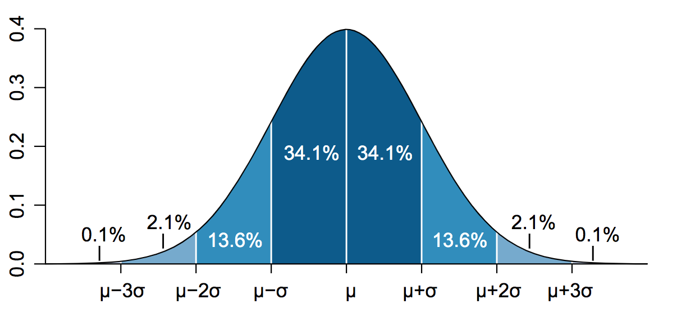

# CURSO DE ACTUALIZACION EN ESTADISTICA

#### Profesor: Dr. José Manuel MAGALLANES, Ph.D

____

## Sesión 5: 

## **Posición y Forma**

____

Las medidas de posición buscan informarnos sobre los valores que cierta porción de los datos sobrepasa o alcanza, y las medidas de forma tratan de informar qué tanto se desvía una variable de la curva "normal" ideal.



### Parte 1. **Posición**

Veamos los datos sobre accidentes nuevamente:

```{r, eval=TRUE}
link2='https://docs.google.com/spreadsheets/d/e/2PACX-1vSKuD4fkPOCgoRhefu9cDLzKJe-tkZ8V0EDPihgr2B6PZK3j-MGAfcSyNRQ91hzhuEh_iCebo1-8DWu/pub?gid=1869012038&single=true&output=csv'

accidentes=read.csv(link2, stringsAsFactors = F)
#
str(accidentes)
```


Sumemos la cantidad de accidentes por año, del 2000 al 2006:

```{r}
# comando "rowSums"
# aplicandolo de la columna 2 hasta la 8 inclusive
accidentes$totalAcci=rowSums(accidentes[,c(2:8)])

#este es el resultado de la columna nueva
accidentes$totalAcci
```

Grafiquemos esos datos en un boxplot:

```{r}
library(ggplot2)
base=ggplot(accidentes,aes(y=totalAcci))
box= base + geom_boxplot() + coord_flip()
box
```

El boxplot es muy bueno para informarnos las posiciones. Calculamos los cuartiles:

```{r}
cuartiles=quantile(accidentes$totalAcci,probs = c(0.25,0.5,0.75))
cuartiles
```

Esos son los valores representados por la caja central.
```{r}
box+ scale_y_continuous(breaks=as.vector(cuartiles))
```

De ahí, sabemos que el 25% de los valores más bajos no supera 5 accidentes, y que el 25% de los más altos no baja de 13 accidentes. Recuerda que la mediana es el cuartil 2.

El valor a la derecha, representado por un punto, representa un valor **atípico**. Ante la presencia de atípicos, la mediana es más informativa que la media.

Si deseas verlo en el histograma:

```{r}
base=ggplot(accidentes,aes(x=totalAcci))

histNum= base + geom_histogram(bins=7,fill='gray') 
histNum + geom_vline(aes(xintercept = cuartiles[1],color="q1")) +
          geom_vline(aes(xintercept = cuartiles[2],color="med")) +
          geom_vline(aes(xintercept = cuartiles[3],color="q3"))
  
```

### Parte 2. **Apuntamiento o Curtosis**

Usemos un histograma teniendo como fondo la curva normal:

```{r}
base + geom_histogram(aes(y =..density..), bins=7,
                   colour = "black", 
                   fill = "white") +
stat_function(fun = dnorm,args = list(mean = mean(accidentes$totalAcci),
                                      sd = sd(accidentes$totalAcci)),
              col='red')
```

Esto nos sugiere que hay mucho apuntamiento, verifiquemos si se obtiene un valor positivo:

```{r}
library(DescTools)
set.seed(123)
Kurt(accidentes$totalAcci,conf.level = 0.05, ci.type = 'bca', method = 2)
```

R te dice aquí que el coeficiente de curtosis para estos datos; y también te informa donde estaría el verdadero valor en poblaciones de este tipo. Si el intervalo tocase el cero, es probable que no haya curtosis en estos datos.


### Parte 3. **Asimetría**

La asimetría informa la presencia de colas hacia la derecha o la izquierda. Como los valores extremos producen asimetría, ya los gráficos anteriores nos informan que hay una cola a la derecha. En esas situaciones, el coeficiente de asimetría debe ser positivo:
```{r}
Skew(accidentes$totalAcci,conf.level = 0.05, ci.type = 'bca')
```

La asimetría positiva se confirma  por que el intervalo de coeficiente no toca el cero.

Recordemos este histograma:

```{r}
base=ggplot(accidentes,aes(x=totalAcci))

histNum= base + geom_histogram(bins=7,fill='gray') 
histNum +geom_vline(aes(xintercept = mean(accidentes$totalAcci, na.rm = T),color="media")) +
         geom_vline(aes(xintercept = median(accidentes$totalAcci, na.rm = T),color="mediana")) +
         scale_color_manual(name = "Centralidad", values = c(mediana = "blue", media = "red"))
  
```

Recuerda que la asimetría positiva hace que la media sea mayor que la mediana. Si hubiera sido negativa, la mediana es mayor que la media.

**Ejercicio:**

Utilice sus datos y calcule las medidas que correspondan.

____

[Volver al programa del curso](https://coursesandtutorials.github.io/Estadistica/)

